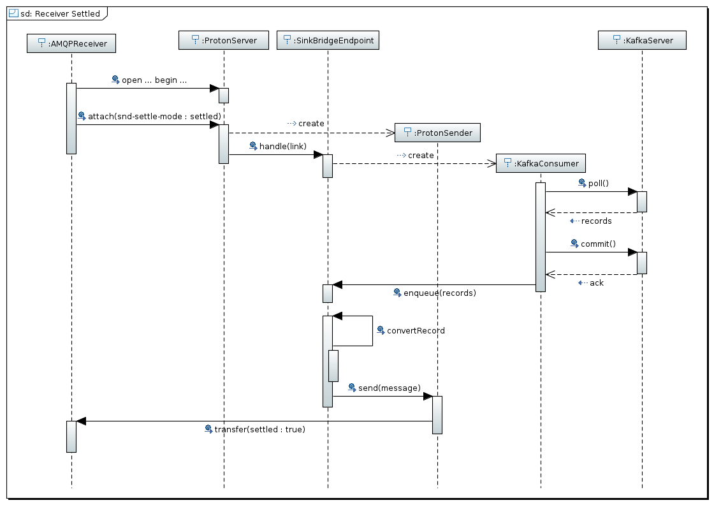
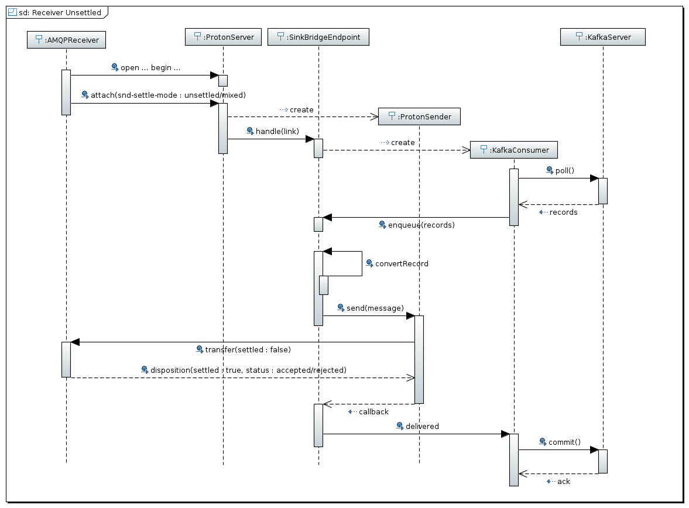

Following the Sequence Diagrams for the receiving operation by AMQP receiver clients.

## Receiver : settled mode

In this scenario the AMQP receiver requests for the `snd-settle-mode` as `settled` on link attachment so it expects to receive messages with the settled flag to `true` from the internal AMQP sender. The sink bridge endpoint gets messages from the Kafka server using the internal Kafka Consumer and uses the internal AMQP sender to send them to the receiver. The operations sequence is the following :

* the Kafka Consumer poll for records from Kafka server
* the Kafka Consumer executes immediately a commit on Kafka server in order to save the offset of records read
* the above records are copied into an internal queue which is read by the AMQP sender in order to send messages

In tha above sequence, if Kafka Consumer commit fails, messages aren't sent but on next poll they will be retrivied another time. Otherwise, if the sending operation fails and some messages aren't sent, they will be lost because Kafka Consumer has already committed the offset.
On the internal AMQP sender side, it sends messages and doesn't wait for any acknowledgment from receiver. We can consider it an AT MOST ONCE delivery.

## Receiver : unsettled mode

In this scenario the AMQP receiver requests for the `snd-settle-mode` as `unsettled` on link attachment so it expects to receive messages with the settled flag to `false` from the internal AMQP sender in order to reply with a disposition message contains settled flat to `true`. The sink bridge endpoint gets messages from the Kafka server using the internal Kafka Consumer and uses the internal AMQP sender to send them to the receiver. The operations sequence is the following :

* the Kafka Consumer poll for records from Kafka server
* the above records are copied into an internal queue which is read by the AMQP sender in order to send messages
* the Kafka Consumer checks if it's needed to commit on Kafka server in order to save the offset of messages polled, sent and acknowledged by receiver

In tha above sequence, if Kafka Consumer commit fails, messages already sent by the internal AMQP sender will be polled next time and re-sent.
The commit depends on feedback that the internal AMQP sender is receiving from receiver (disposition frame). An OffsetTracker is used in order to track what is offsets related to acked messages and that the Kafka Consumer has to commit.

If receiver ack the message in order, all works fine.
If receiver ack the message OUT OF ORDER we could have messages loss and it depends on the following available solutions :

* Tracking ONLY the offset for the LAST settled (acked) message. If there are unsettled message before it they won't be redelivered. It means AT LEAST ONCE NOT guaranteed.

* Tracking the offset related to the settled (acked) message JUST BEFORE the first NOT settled yet. After that other messages could be acked. When the first unsettled message will be acked, the tracker jumps forward to the last offset JUST BEFORE the first NOT settled message : it will be the offset committed by the Kafka Consumer. In this solution it's possible that messages already settled after the first NOT settled yet will be redelivered. It means AT LEAST ONCE.

## Receiver : mixed mode

In this scenario the AMQP receiver specifies the `snd-settle-mode` as `mixed` so it can mix the above behavior for each single message.

## Receiver : flow control

The flow control related to the messages from Apache Kafka to AMQP receivers is handled in two ways :

* the sink endpoint takes in account the credits granted by the AMQP reicever. If credits end, the sink endpoint _pauses_ the Kafka consumer to avoid reading other messages from the server. When the AMQP receiver grants new credits to the sink endpoint then it _resumes_ Kakfa consumer;
* in order to avoid a lot of memory allocation for internal buffering from Kafka consumer to the internal AMQP sender (in the sink endpoint), a threadshold for that buffer is defined. When the buffer effective size exceeds this threashold, the sink endpoint _pauses_ Kafka consumer and _resumes_ it only when more space in the buffer is available;
